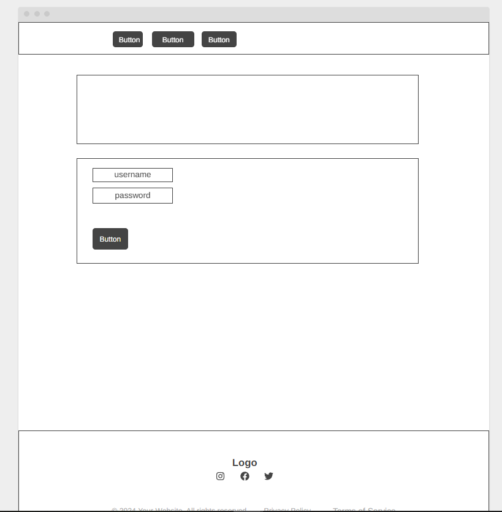
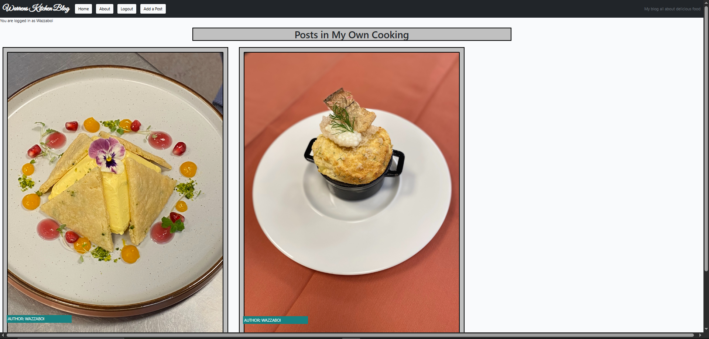

### My Blog App

Portfolio 4 project as part of the Diploma in Full Stack Software Development by Code Institute.

---

Warrens Kitchen is a blog, mainly to record and share my culinary adventures both consuming and producing the food that I love and am discovering to love.

It is a fullstack blog site that allows users to add, delete and update blog posts, create an account, login, logout and comment on the posts.

Link to live site - [https://django-project-blog-4-98f76f4fa7a3.herokuapp.com]

## CONTENTS

- [Warrens Kitchens Blot](#Warrens-kitchen-blog)
  - [CONTENTS](#contents)
  - [Site Objectives](#site-objectives)
- [User Experience/UX](#user-experienceux)
  - [Target Audience](#target-audience)
  - [User Stories](#user-stories)
    - [New Visitor Goals](#new-visitor-goals)
    - [Existing Visitor Goals](#existing-visitor-goals)
- [Design Choices](#design-choices)
  - [Colour Scheme](#colour-scheme)
  - [Typography](#typography)
  - [Logo and Favicon](#logo-and-favicon)
  - [Wireframes](#wireframes)
  - [Flow Diagram](#flow-diagram)
  - [Database Plan](#database-plan)
- [Features](#features)
  - [Registration](#registration)
  - [Future Features](#future-features)
  - [Features Not Included](#features-not-included)
- [Technologies Used](#technologies-used)
- [Programming Languages, Frameworks and Libraries Used](#programming-languages-frameworks-and-libraries-used)
- [Agile](#agile)
- [Testing](#testing)
  - [Manual Testing](#manual-testing)
  - [User](#user)
  - [Bugs](#bugs)
  - [Lighthouse](#lighthouse)
  - [Validation Testing](#validation-testing)
    - [HTML \& CSS](#html--css)
  - [Python Testing](#python-testing)
  - [Deployment](#deployment)
    - [Github Deployment](#github-deployment)
    - [Creating a Fork or Copying](#creating-a-fork-or-copying)
    - [Clone](#clone)
    - [Repository deployment via Heroku](#repository-deployment-via-heroku)
    - [Deployment of the app](#deployment-of-the-app)
  - [Credits](#credits)
  - [Media](#media)
  - [Acknowledgments and Thanks](#acknowledgments-and-thanks)

---

## Site Objectives

Design and create a blog site to demonstrate an increasing understanding of the libraries and frameworks available to developers.

My three main objectives were:

- ### Create a readable, clean and responsive front end

  I wanted to make the site easily accessible and intuitively navigated for the users. Django and Bootstrap were used to create and style the front end.

- ### Make use of available backend functionality

  The use of the backend framework allows users to create a profile and through that profile post their own posts, update them and delete them without using the admin panel, comment on any of the blog posts on the site, as well as deleting their own comments should they wish to.

- ### Store data on an external cloud database

  I used ElephantSQL to store the PostgreSQL database for this project.

---

# User Experience/UX

## Target Audience

- Users that are interested in Cooking, Fine dining or just eating out.

## User Stories

### New Visitor Goals

- To understand what the site and content is about.
- How to navigate the site.
- Create an account and engage with the site and other users and site owner.

### Existing Visitor Goals

- Log in and out of their account.
- Create, delete and update a post.
- Read blog posts and comments on each post.
- Add their own comments on blog posts on the site to engage with site owner and other users.

---

# Design Choices

## Colour Scheme

The colour scheme used for this project was based on the colors from Code Institute's 'I think therefore I blog' walkthrough module. I have added and modified many aspects of the styling and colours to suit my intentions. It is a fairly neutral scheme, with only the actionable aspects (buttons/links etc) displayed in brighter colours for ease of navigation or site use.

## Typography

The main font used is Lato, but Great Vibes was used for the main logo text on the navbar

## Wireframes

- Homepage Wireframe

- About page Wireframe

- Login page Wireframe

- Logout page Wireframe

- Add a post page Wireframe

- Post detail page Wireframe

- Register page Wireframe

## Flow Diagram

Here is a diagram showing the possible flow through the site. There are 2 sections shown here. On the left it shows the Admin and the right shows a site user.

## Database Plan

The database plan is fairly simple, but it shows the information that is stored within the database, the type of data and if it is logged as a Primary or Foreign key where applicable.

# Features

## Registration

The user can create an account

View Blog Posts on Home Page

Browse by Post Category

About page

Add a post page

Post detail page

Login page

Logout page

Comment on Blog Posts.

---

# Technologies Used

Here are the technologies used to build this project:

- [CodeAnywhere](https://codeanywhere.com/) To build and create this project
- [Github](https://github.com) To host and store the data for the site.
- [CodeAnywhere](https://www.codeanywhere.com) the IDE where the site was built.
- [PEP8 Validator](https://pep8ci.herokuapp.com/) Used to check python code for errors
- [ElephandSQL](https://www.elephantsql.com/) Used to store PostgreSQL database.
- [Cloudinary](https://cloudinary.com/) Used as cloud storage for images uploaded as part of the blog posts
- [Heroku](https://id.heroku.com/) Used to deploy the project

# Programming Languages, Frameworks and Libraries Used

- [HTML](https://developer.mozilla.org/en-US/docs/Web/HTML)
- [CSS](https://developer.mozilla.org/en-US/docs/Learn/Getting_started_with_the_web/CSS_basics)
- [Python](<https://en.wikipedia.org/wiki/Python_(programming_language)>)
- [Django](https://www.djangoproject.com/)
- [Bootstrap](https://getbootstrap.com/)

# Agile

This project was designed using Agile methodology, utilising the Project Board and Issues sections in GitHub

- [Project Board](https://github.com/users/Wazza1999/projects/11)

# Testing

As each section or Function/Model was built during this project, I was testing for functionality and styling issues that may have arisen (see table below), which were corrected or fixed before continuing. I also had friends test the site by signing up, adding and deleting comments using various devices on varying platforms (IOS, Android, Mobile, Tablet etc) and reporting back any issues they encountered with functionality or styling.

## Manual Testing

_For any Fails, there is a more detailed description below the table_

ADMIN
| TEST | OUTCOME | PASS/FAIL|
|:---:|:---:|:---:|
| Create Blog Post | Post successfully created and displayed | Pass |
| Edit Blog Post | Editing post in the website successful | Pass |
| Delete Blog Post | Deleting selected post successfull | Pass |
| Delete User Comments | Comment deleted successfully | Pass |
| Create 4 Test Posts to check Pagination | Next/Previous Page Appears at bottom of screen | Pass |

## User

|                                TEST                                |                                  OUTCOME                                   | PASS/FAIL |
| :----------------------------------------------------------------: | :------------------------------------------------------------------------: | :-------: |
|                           Create Account                           |                            Created successfully                            |   Pass    |
|                               Login                                |                              Login Successful                              |   Pass    |
|                               Logout                               |                             Logout Successful                              |   Pass    |
|                        Read Full Blog Post                         |                    PostDetail page loaded successfully                     |   Pass    |
|                          Add a Blog Post                           |        Add a post page loaded successfully and addition successful         |   Pass    |
|                          Delete Blog Post                          |                  Delete post button working successfully                   |   Pass    |
|                     Add Comment under Blogpost                     |                         Comment Added Successfully                         |   Pass    |
|                           Delete Comment                           |                              Comment Deleted                               |   Pass    |
|                      Filter Posts by category                      |          Posts marked as selected category displayed successfully          |   Pass    |
| Create User Account to check access to restricted pages (add_post) | Page displayed correct error message, with no access to restricted content |   Pass    |

(\*) See Bugs below

## Bugs

## Lighthouse

The performance scores appear to be low, and I believe this is due to the images uploaded for each blog post being hosted on a third-party cloud-based platform.

Mobile

Desktop

## Validation Testing

### HTML & CSS

HTML & CSS testing was completed using [W3 Validator](https://validator.w3.org/)

When validating the code, I had the error shown below. this was fixed by removing the button and using Bootstrap styles to display the link as a button instead

Fixed:

## Python Testing

Python pep8 validation was done via [Code Institute's Python Linter](https://pep8ci.herokuapp.com/)

The only errors recieved here were where some lines of text exceeded the limit of 79 characters, but these have now been rectified.

Python Files Tested:

- models
- forms
- views
- urls

---

## Deployment

### Github Deployment

The website was stored using GitHub for storage of data and version control. To do this I did the following;

After each addition, change or removal of code, in the terminal within your IDE (I used codeanywhere for this project) type:

- git add .
- git commit -m "meaningful commit message"
- git push

The files are now available to view within your github repository.

### Creating a Fork or Copying

To clone/fork/copy the repository you click on the fork tab which is situated next to unwatch tab in the top right corner of the page

### Clone

To create a clone you do the following;

1. Click on the code tab, left of the Gitpod tab
2. To the right of the repository name, click the clipboard icon
3. In the IED open GitBash
4. Change the working directory to the location you prefer
5. Add Git Clone with the copy of the repository name
6. Clone has been created

### Repository deployment via Heroku

- On the [Heroku Dashboard](https://dashboard.heroku.com) page, click New and then select Create New App from the drop-down menu.
- When the next page loads insert the App name and Choose a region. Then click 'Create app'
- In the settings tab click on Reveal Config Vars and add the key Port and the value 8000. The credentials for this app were:

1. Cloudinary URL
2. Postgres Database URL
3. Port (8000)

- Below this click Add buildpack and choose python and nodejs in that order.

### Deployment of the app

- Click on the Deploy tab and select Github-Connect to Github.
- Enter the repository name and click Search.
- Choose the repository that holds the correct files and click Connect.
- A choice is offered between manual or automatic deployment whereby the app is updated when changes are pushed to GitHub.
- Once the deployment method has been chosen the app will be built and can be launched by clicking the Open app button which should appear below the build information window, alternatively, there is another button located in the top right of the page.

---

## Credits

This project was based on the Code Institute's - I think therefore I blog walkthrough module which provided a standard blog 'base'. From this base I customised a lot of the layout and styling with Bootstrap and custom CSS. I also added a custom model for Category. This allowed me to create a functionality within the site for users to filter the blog posts by a selected category.

I also added several custom Views and Forms to the site, as well as ensuring that all links and desired functionality was working as intended with no errors.

The Readme layout was based on the example by [Kera Cudmore - Readme Examples](https://github.com/kera-cudmore/readme-examples/blob/main/README.md?plain=1) and [Sdalsosa - Readme](https://github.com/Sdalsosa/ComposerHub/blob/main/README.md)

The wireframe mockups were created using [Wireframecc](https://wireframe.cc/)

---

## Media

For placeholder images when no image is uploaded to blog post, I have used a stock image of a chef to stick with the theme

All other content and images are my own.

---

## Acknowledgments and Thanks

Oisin, Rebecca and Gemma at Code Institute's tutor support for the help and guidance with my code-related brain melts.

For help with manual testing:

- Chloe Timlin
